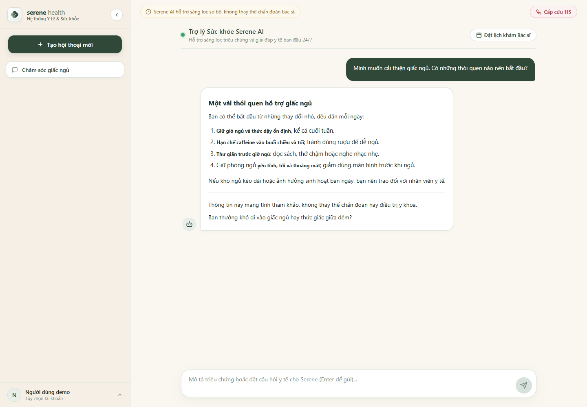
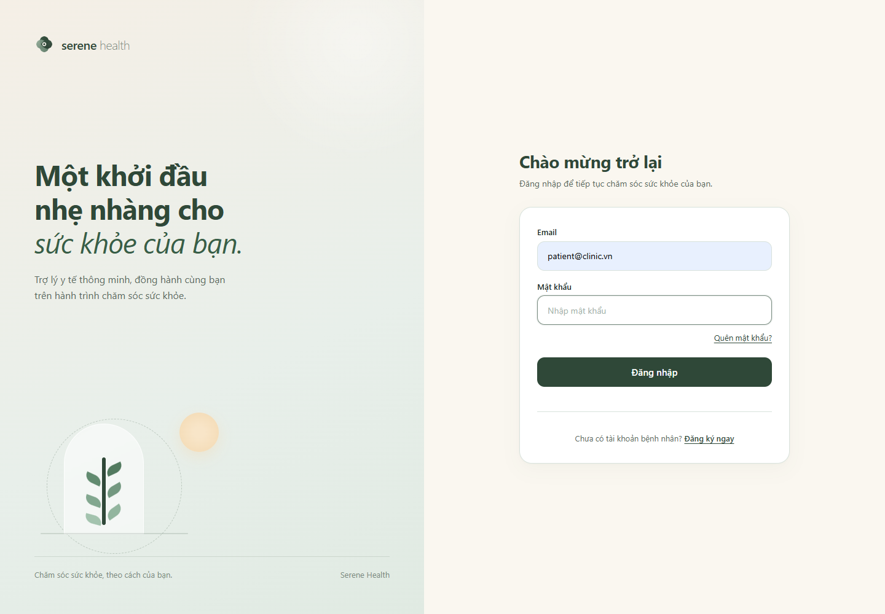
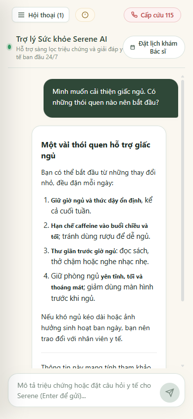

# Serene Health — MVP Chatbot Y tế

Serene Health là ứng dụng web hỗ trợ hỏi đáp sức khỏe ban đầu bằng tiếng Việt. Người dùng có thể mô tả triệu chứng, đặt câu hỏi và trao đổi với **Serene AI** trong giao diện trò chuyện đơn giản, nhẹ nhàng.

**Trạng thái: MVP đang phát triển.** Phạm vi hiện tại tập trung vào trải nghiệm chatbot dành cho người dùng cá nhân, chưa giới thiệu các vai trò vận hành khác như một phần của sản phẩm MVP. Một số module mở rộng đã có trong mã nguồn nhưng không thuộc phạm vi giới thiệu của README này.

> **Lưu ý y tế:** Serene AI không phải bác sĩ. Nội dung phản hồi chỉ mang tính tham khảo, không thay thế việc khám, chẩn đoán hoặc điều trị. AI có thể trả lời sai hoặc bỏ sót thông tin quan trọng. Nếu có dấu hiệu nguy hiểm hoặc tình huống khẩn cấp, hãy gọi **115** tại Việt Nam hoặc đến cơ sở cấp cứu gần nhất; không chờ chatbot phản hồi.

## Giao diện

Ảnh chụp trực tiếp từ giao diện ứng dụng chạy cục bộ. Hội thoại và tài khoản trong ảnh chat sử dụng **dữ liệu minh họa giả lập tại trình duyệt**, không phải hồ sơ người bệnh hay kết quả kiểm thử phản hồi Gemini thực tế.

### Trò chuyện cùng Serene AI



### Đăng nhập



### Trên điện thoại



## MVP hiện có gì?

- **Đăng ký và đăng nhập** để sử dụng không gian trò chuyện cá nhân.
- **Hỏi đáp sức khỏe bằng tiếng Việt**, hỗ trợ tìm hiểu triệu chứng và định hướng chăm sóc ban đầu.
- **Phản hồi dạng streaming**, hiển thị nội dung dần khi AI trả lời; có thể dừng phản hồi đang tạo.
- **Tạo và xem lại hội thoại**, lưu lịch sử tin nhắn trên cơ sở dữ liệu.
- **Hiển thị Markdown cơ bản** trong câu trả lời: tiêu đề, danh sách, chữ đậm và đường phân cách.
- **Giữ lại nội dung đang soạn khi gửi lỗi**, giúp người dùng thử lại mà không phải nhập từ đầu.
- **Tra cứu dữ liệu qua tool calling**: dịch vụ, thông tin bác sĩ, lịch trống và hồ sơ sức khỏe tự khai của người dùng. AI đọc dữ liệu từ backend, không tự đặt hoặc hủy lịch.
- **Cảnh báo an toàn y tế**, kèm bộ lọc từ khóa khẩn cấp ở backend và lối truy cập gọi 115 trên giao diện.

Luồng sử dụng chính: **Đăng ký/đăng nhập → Tạo hội thoại → Đặt câu hỏi → Nhận phản hồi → Xem lại lịch sử.**

## Công nghệ và kiến trúc

- **Frontend:** React 19, TypeScript, Vite, React Router, `@ai-sdk/react`.
- **Backend:** NestJS 11, TypeScript, REST API, JWT.
- **AI:** Google Gemini thông qua Vercel AI SDK, streaming qua SSE.
- **Dữ liệu:** PostgreSQL 17, Prisma 7.
- **Tổ chức dự án:** npm workspaces với hai ứng dụng `apps/web` và `apps/api`.

```text
Trình duyệt (React)
    │ REST API + streaming SSE
    ▼
Backend (NestJS)
    ├── Xác thực, kiểm tra đầu vào và quyền truy cập hội thoại
    ├── Lưu/tải lịch sử hội thoại ── PostgreSQL / Prisma
    ├── Kiểm tra từ khóa khẩn cấp
    └── Vercel AI SDK ── Google Gemini
            └── Tool calling ── các service truy vấn dữ liệu
```

MVP **chưa sử dụng RAG, embeddings hoặc vector database**. Tool calling dùng để tra cứu dữ liệu có cấu trúc trong ứng dụng; đây không phải hệ thống truy xuất tài liệu y khoa đã được thẩm định. Khóa API Gemini chỉ được cấu hình phía backend.

## Chạy trên máy local

### 1. Chuẩn bị

- **Node.js 22.12+** hoặc Node.js 24 LTS, npm đi kèm.
- **Docker Compose** để chạy PostgreSQL, hoặc một PostgreSQL instance riêng.
- **Gemini API key** từ [Google AI Studio](https://aistudio.google.com/) để dùng phản hồi AI.

Tại thư mục gốc dự án:

```bash
npm ci
```

### 2. Cấu hình môi trường

Tạo `apps/api/.env` và điền các biến sau bằng cấu hình của môi trường local:

| Biến | Mục đích |
| --- | --- |
| `DATABASE_URL` | Kết nối PostgreSQL của bạn, khớp với database đã chuẩn bị |
| `JWT_SECRET` | Khóa ký JWT ngẫu nhiên, tối thiểu 32 ký tự; không dùng khóa mẫu hoặc tái sử dụng khóa production |
| `GEMINI_API_KEY` | API key Gemini của bạn, chỉ lưu phía backend |
| `GEMINI_MODEL` | Model Gemini, mặc định `gemini-2.5-flash` |
| `PORT` | Cổng backend, mặc định `3000` |
| `FRONTEND_URL` | Origin frontend được phép truy cập API, local là `http://localhost:5173` |

Tạo `apps/web/.env` nếu cần chỉ định địa chỉ backend:

```dotenv
VITE_API_URL=http://localhost:3000
```

Frontend mặc định gọi `http://localhost:3000`; API client tự bổ sung tiền tố `/api/v1`. Frontend gọi trực tiếp backend, không cần cấu hình proxy Vite. Khi đổi cổng hoặc domain frontend, cập nhật `FRONTEND_URL` tương ứng và khởi động lại dịch vụ.

**Không commit file `.env`, API key, khóa JWT hoặc thông tin kết nối riêng. Không đặt bí mật trong biến `VITE_*` vì chúng được đưa vào mã frontend.**

### 3. Chuẩn bị database

Khởi động PostgreSQL bằng Compose nếu chưa có database riêng:

```bash
docker compose up -d
```

Sinh Prisma Client và áp dụng migration vào **database local dành cho phát triển**:

```bash
npm run db:generate
npm run db:migrate
```

Có thể nạp dữ liệu mẫu để thử các truy vấn dịch vụ và lịch trống:

```bash
npm run db:seed
```

Chỉ chạy seed trên database thử nghiệm. Đăng ký tài khoản mới từ giao diện để trải nghiệm chatbot; không cần dùng tài khoản mẫu.

### 4. Chạy ứng dụng

Mở hai terminal tại thư mục gốc:

```bash
# Terminal 1 — backend
npm run dev:api
```

```bash
# Terminal 2 — frontend
npm run dev:web
```

- **Ứng dụng:** <http://localhost:5173>
- **API:** <http://localhost:3000/api/v1>
- **Swagger:** <http://localhost:3000/api/docs>

Dùng `Ctrl+C` trong từng terminal để dừng dev server. Nếu đã khởi động database bằng Compose, dùng `docker compose stop` để dừng container mà không xóa dữ liệu.

## Kiểm tra và build

```bash
npm run typecheck
npm run test:web
npm run test:api
npm run build:web
npm run build:api
```

Chạy `npm run db:generate` trước khi kiểm tra hoặc build backend. Các lệnh trên là hướng dẫn chạy kiểm tra, không phải cam kết rằng mọi kiểm tra đã vượt qua trên mọi môi trường.

## Cấu trúc thư mục

```text
apps/
├── web/src/
│   ├── components/chat/       # Bong bóng chat và hiển thị nội dung
│   ├── pages/auth/            # Giao diện xác thực
│   └── pages/mobile-user/     # Trải nghiệm chatbot của người dùng
└── api/
    ├── src/ai/                # Streaming, prompt, safety và AI tools
    ├── src/conversations/     # Hội thoại và lịch sử tin nhắn
    └── prisma/                # Schema, migration và seed
docs/screenshots/              # Ảnh giao diện dùng trong README
```

## Giới hạn hiện tại

- Đây là **MVP chatbot**, chưa phải sản phẩm y tế được thẩm định để sử dụng lâm sàng hoặc nền tảng vận hành phòng khám hoàn chỉnh.
- Prompt hướng dẫn AI không chẩn đoán chắc chắn, không kê đơn hoặc chỉ định liều thuốc; các hướng dẫn này **không bảo đảm** mọi phản hồi luôn chính xác và an toàn.
- Bộ lọc khẩn cấp dựa trên từ khóa/mẫu câu có thể bỏ sót hoặc nhận diện nhầm; không dùng nó để loại trừ tình trạng cấp cứu.
- Chất lượng và tốc độ phản hồi phụ thuộc model, kết nối mạng, quota và tình trạng dịch vụ Gemini.
- Khi sử dụng AI, nội dung hội thoại và dữ liệu cần thiết cho phản hồi có thể được gửi tới nhà cung cấp model. Không nhập thông tin định danh hoặc hồ sơ y tế nhạy cảm trong môi trường demo.
- Các luồng vận hành nhiều vai trò và tư vấn trực tiếp không thuộc phạm vi MVP được giới thiệu ở đây. README này không đồng nghĩa các module có sẵn đã bị xóa hoặc vô hiệu hóa trong mã nguồn.

Ưu tiên tiếp theo là kiểm thử chất lượng câu trả lời, cải thiện khả năng nhận diện tình huống nguy hiểm và hoàn thiện trải nghiệm chatbot trước khi mở rộng phạm vi sản phẩm.
